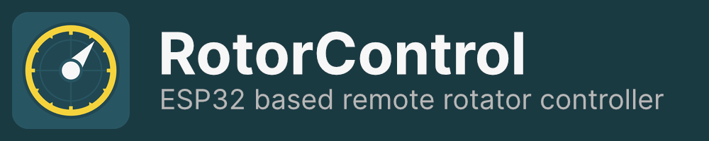
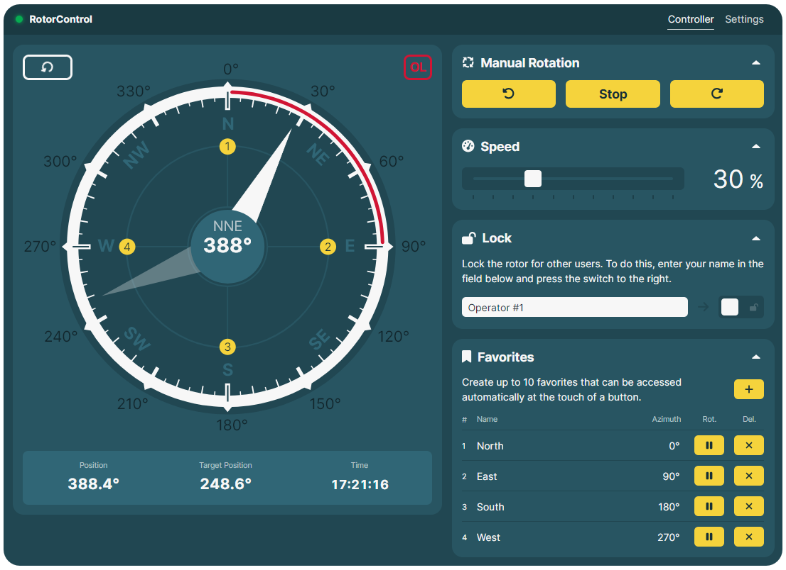

# RotorControl
**RotorControl** is an ESP32 based project, designed to remotely control **Yaesu G-800/1000/2800** rotators from any device using a browser. The control unit of the aformentioned Yaesu rotators has an external control plug at the back. This Mini-DIN plug allows other devices to read out the rotor position and to start and stop rotations. In this project we use an ESP32 to connect to the control unit via this plug and to steer the rotator. It also connects to a local WiFi network and hosts a [Vue.js](https://vuejs.org/) based web interface, which can be accessed by any modern browser.

### Features:
- Remotely control rotator from a modern browser.  
- Support for multiple users to control the same rotor.
  - Users can temporarily lock the rotor for others.  
- Modern, easy-to-use user interface with:
  - Language support in English and German.
  - Multiple color themes for personalization.  
  - Customizable heading dial.  
- Intuitive "point-and-shoot" mode: simply tap on the dial to rotate to the desired position.  
- Save up to 10 favorite positions with customizable names for quick access.  
- Use the arrow keys on your keyboard for precise manual control of the rotor.  
- Smooth acceleration and deceleration.
- Use overlap area to optimize rotation path.
- Support for a mini display (SSD1306).

### User Interface

## Table of Contents
* [Hardware](#hardware)
  + [Pin Configuration](#pin-configuration)
* [Build & Flash Firmware](#build-flash-firmware)
  + [Step 1 (UI)](#step-1-ui)
  + [Step 2 (Firmware)](#step-2-firmware)
  + [Step 3 (Filesystem)](#step-3-filesystem)
* [Serial Monitor](#serial-monitor)
* [Initial Setup](#initial-setup)
  + [Connect to WiFi Network](#connect-to-wifi-network)
  + [Open UI](#open-ui)
* [Calibration](#calibration)
* [Security](#security)

## Hardware
To build your own RotorControl device, you need the following components:

- **ESP32** development board with 4MB flash memory. [[↗]](https://www.az-delivery.de/en/products/esp-32-dev-kit-c-v4)
- **ADS1115** ADC module. [[↗]](https://www.az-delivery.de/en/products/analog-digitalwandler-ads1115-mit-i2c-interface?_pos=1&_sid=02f9dc370&_ss=r)
- 2/3 voltage divider to scale down 0-4.5 V to 0-3 V, e.g.\
  $V_{\mathrm{in}} \leftrightarrow 1\mathrm{k}\Omega \leftrightarrow V_{\mathrm{out}} \leftrightarrow 2\mathrm{k}\Omega \leftrightarrow \mathrm{GND} $
- One **LED** with a corresponding resistor.
- One **push button**.
- SSD1306 OLED display **(optional)**, 0.96" with 128x64 pixels. [[↗]](https://www.az-delivery.de/en/products/0-96zolldisplay?_pos=1&_sid=6660f1687&_ss=r)
- **6-pin MINI-Din** cable and a corresponding plug or socket. [[↗]](https://www.reichelt.com/de/en/shop/product/build-in_mini-din_jack_6-pin-235714?country=de&CCTYPE=private&LANGUAGE=en#closemodal)

### Pin Configuration
The project uses the following pin configuration. Some of these pins can be changed in `include/globals.h`.
| Hardware | Pin(s) |
| -------- | --- |
| LED $+$ | ESP Pin 19 |
| Push Button | ESP Pin 32 & GND |
| ADS1115 SCL | ESP Pin 22 |
| ADS1115 SDA | ESP Pin 21 |
| ADS1115 A0/C0  | Voltage divider $V_\mathrm{out}$ | 
| SSD1306 SCL | ESP Pin 22 |
| SSD1306 SDA | ESP Pin 21 |
| Ext. control Mini-DIN Pin 1 | ESP Pin 25  |
| Ext. control Mini-DIN Pin 2 | ESP Pin 33  |
| Ext. control Mini-DIN Pin 3 | ESP Pin 26  |
| Ext. control Mini-DIN Pin 4 | Voltage divider $V_\mathrm{in}$  |
| Ext. control Mini-DIN Pin 5 | GND  |
| Ext. control Mini-DIN Pin 6 | N/C  |

> [!CAUTION]
> Directly connecting Mini-DIN Pin 4 from the control unit's external control socket to any GPIO pin on the ESP32 or to an ADS1115 channel without a voltage divider will cause damage to these components!

> [!NOTE]
> The control unit requires a control voltage between 0-5 V to adjust the rotor's speed. In this setup, we use the integrated DAC of the ESP32 to generate the control-voltage. However, since the DAC is limited to 3.3V, the maximum achievable speed with RotorControl is limited to approximately 60% of full speed.

## Build & Flash Firmware
### Step 1 (UI)
Before compiling the firmware, you must first build the Vue.js web UI. Detailed instructions for this process can be found in the [vue-app/README](./vue-app/README.md). Follow the steps there to prepare the UI for deployment.

### Step 2 (Firmware)
RotorControl is developed using the [PlatformIO](https://platformio.org/) IDE on VSCode.\
Use the **Upload** task in PlatformIO to build and upload the firmware to the ESP.

>[!TIP]
> Adding `-D DEMO_MODE=1` to the `build_flags` section in `platformio.ini` compiles the firmware in a mode, where the commands for remotely disconnecting the ESP32 from WiFi and for performing OTA firmware updates are disabled.

### Step 3 (Filesystem)
RotorControl uses a LittleFS filesystem to store favorites and the setup page.\
Use the **Upload Filesystem Image** task in PlatformIO to build and upload the filesystem.

## Serial Monitor
RotorControl offers an extensive log output over a serial connection. Connect to the ESP with a baud rate of 115200 to monitor the device.

## Initial Setup
Upon first launch, RotorControl will boot into **setup mode**. In this mode, the ESP creates its own WiFi network called `RotorControl-XXXXXXXXXXXX`. When RotorControl is in **setup mode**, the LED lights up continously.

To set up RotorControl, connect your phone or laptop to that network and open a browser. Navigate to either `rotor.local` or `192.168.4.1`. In the interface that appears, you can first:
- set the username and password that is required to connect to the RotorControl UI.
- optionally, change the port, under which RotorControl can be reached.

> [!TIP]
> Having an SSD1306 display connected can simplify the setup process by providing easy access to information, such as the device's status and IP address.

### Connect to WiFi Network
In **setup mode**, the ESP continously scans for available WiFi networks in the area. From the displayed list, select the network you want your ESP to connect to, enter the network password, and click on "Verbinden". If your desired network is not visible, wait a few seconds and refresh the page.

> [!IMPORTANT]
> The ESP32 only supports 2.4 GHz WiFi and RotorControl only supports IPv4.

Once you initiate the connection, the ESP switches to the default operating mode and attempts to connect to the selected WiFi network. The LED indicates the status of the network connection:

| LED | RotorControl Status |
| --- | ------------------- |
| ON  | **Setup mode**, WiFi not connected |
| OFF | **Default mode**, WiFi connected |
| Blinking, every 6 s | Trying to connect to WiFi |

If the LED continues blinking, it indicates a connection failure, likely due to an incorrect password.
To reset RotorControl to **setup mode**, press and hold the push button for a few seconds. The LED will blink rapidly four times to confirm the reset.

### Open UI
Once the ESP is succesfully connected, you can begin using RotorControl and access the user interface. To do so, open a browser on any device connected to the same network as the ESP and navigate to `rotor.local`. If you changed the default port, use `rotor.local:[port]` instead, replacing `[port]` with the specific port number you configured.

## Calibration
To ensure RotorControl displays the correct rotor position, calibration is required.
To calibrate, go to `Settings > Calibration > Rotor Calibration` and choose either the guided, or manual calibration process. Before, ensure the physical control unit of the rotator is calibrated, too.

## Security
While RotorControl can be used to control a rotator over the internet, it is strongly recommended to do so only via a VPN connection to your network!

Currently, the system lacks encryption, and the websocket connection used to send control commands from the UI to the ESP32 does not include authorization. As a result, if you expose RotorControl to the public internet, there is a risk that anyone could potentially gain control of your rotor.
